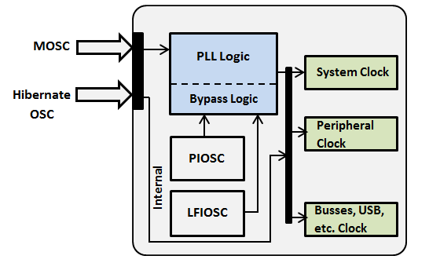
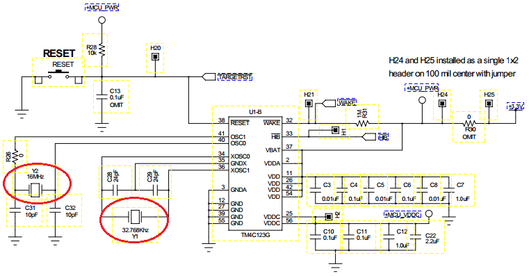
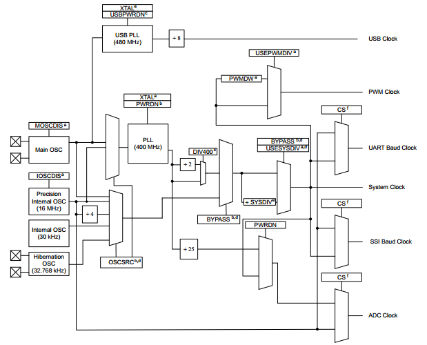
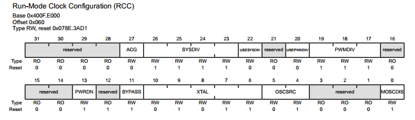
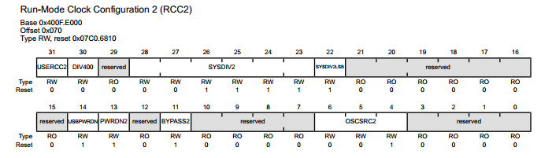
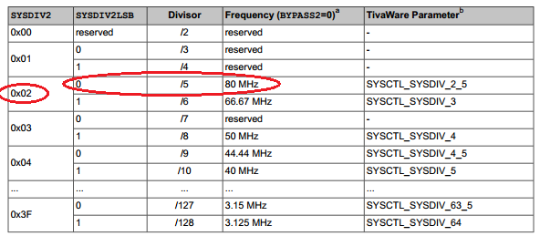

#PLL and Clock Settings in TM4C123GH6PM
The most fundamental element of any Microprocessor or Microcontroller is Clock Source. Its like heart beat that keeps the Microcontroller/Microprocessor alive and running. If the clock source is removed, the Microcontroller/Microprocessor stops executing the application program. The TM4c123 LaunchPad controller provides 4 clock sources to be customized and used in different scenarios. Two of them are internal to TM4C123GH6PM and two external clock ports are provided to add external clock sources or crystal oscillators. The clock sources includes:      
•	Main Oscillator (MOSC)                              [External]   
•	Hibernate OSC                                       [External]   
•	Precision Internal Oscillator (PIOSC)               [Internal]   
•	Low Frequency Internal Oscillator (LFIOSC)          [Internal]   

 

  

 
On Tiva TM4C123 the PIOSC is 16MHz with 1% accuracy. LFIOSC is 30KHz with 50% accuracy. External clock crystals of 32.768KHz for Hibernate Oscillator and 16MHz as MOSC. 
 

  

 

Why MOSC is 16MHz????
This is clear from bellow diagram.

 

  

 
As shown in above diagram, the MOSC sources 480MHz PLL for USB clock. From Datasheet 

> “To function within the clocking requirements of the USB specification, a crystal of 5, 6, 8, 10, 12, or 16 MHz must be used.”  

That is one of the reason a standard high precision 16Mhz crystal is attached at MOSC clock source.
 
### Registers:
Two Registers are used to setup PLL, system clock and peripheral clock as shown in above figure. i.e. **RCC** and **RCC2**.
 
 

  

 
 

  

 
We will use on RCC2 to configure PLL. Following are the steps.
 
### Steps:
•	Activate RCC2 to ignore RCC register values except Crystal frequency. **RCC2 -> USERCC2 -> 1**  
•	Bypass PLL to isolate it. **RCC2 -> BYPASS2 -> 1**  
•	Select MOSC as main clock source to PLL. **RCC2 -> OSCSRC2 -> 0x0**  
•	Select clock frequency. **RCC -> XTAL -> 0x15**  
•	Enable 400MHz PLL. **RCC2 -> DIV400 -> 1**  
We want the frequency to be set to maximum clock frequency allowed for TM4C123GH6PM. From bellow table.

 

  

 

•	Clear SYSDIV2LSB (from above table). **RCC2 -> SYSDIV2LSB -> 0 **  
•	Set the Divisor to be 5. From table (0x02). **RCC2 -> SYSDIV2 -> 0x02**  
•	Wait for the PLL to Setup. **While (RIS -> PLLRIS  != 1)**  
•	Remove Bypass from PLL to source main clock. **RCC2 -> BYPASS2 -> 0**  

   
