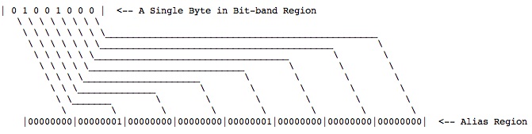
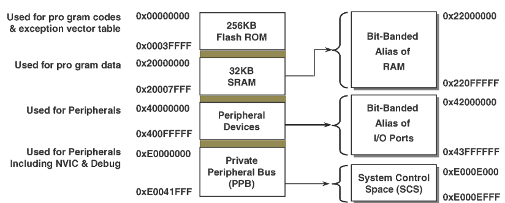

#BIT BAND REGION PROGRAMMING.
Bit-banding is a term that ARM uses to describe a feature that is available on the Cortex M3 and M4 CPU cores. Basically, the device takes a region of memory (the Bit-band region) and maps each bit in that region to an entire word in a second memory region (the Bit-band Alias Region).
The benefit of Bit-banding is that a write to a word in the alias region performs a write to the corresponding bit in the Bit-band region. Also, reading a word in the alias region will return the value of the corresponding bit in the Bit-band region. These operations take a single machine instruction thus eliminate race conditions. This is especially useful for interacting with peripheral registers where it is often necessary to set and clear individual bits.
The image below shows a byte in the Bit-band region on the top. The bottom row of bytes represent the bit-band alias region.
 

  

 
The formula to get the alias address of single bit in bit band region is as follow:
FORMULA: Bit Band Alias Region Base Addr + (byte offset from bit band region x 32 ) + (bit number x 4 )
 

  

  
RESOURCES:
1) Bai Y.Practical Microcontroller Engineering with ARM Technology
2) https://spin.atomicobject.com/2013/02/08/bit-banding/